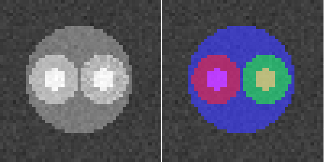

This is a MATLAB/C++ for our multi-region segmentation paper [1].

The code supports segmentation with arbitrary number of regions, inclusion and exclusion constraints.

Results from a toy example.

Requirements 
---
1. MATLAB and a c++ compiler.

Getting started
---
1. Run mex -setup.
2. Run example.m in MATLAB, the mex'ed c++ code compiles automatically.

All functionally is described in example.m.

Third party software
---
* To calculate the correct weights for the regularization the code uses
  "Sphere voronoi" [2].
  

* If you use the solver based on lagrangian duality, the code uses the max/flow min solver
	by Yuri Boykov and Vladimir Kolmogorov [3] which reuses flow as described in [4].

* If you use roof duality, the code uses the QPBO software [5].

More resources
---
Martin Rykfors has written a more efficient solver 
if your problem only have inclusions constraints and you are satisfied
with standard connectivities. More details in his [Master thesis](http://www.maths.lth.se/vision/education/pages/Rykfors12/exjobb.pdf) and his
[git repository](https://github.com/MartinRykfors/MultiRegion).

References
----------

1. [An Efficient Optimization Framework for Multi-Region Segmentation based on Lagrangian Duality](http://www.maths.lth.se/vision/publications/publications/view_paper.php?paper_id=531) 
 IEEE Transactions on Medical Imaging 2013. 
 _Johannes Ulén, Petter Strandmark and Fredrik Kahl_

2. [Sphere voronoi](http://people.sc.fsu.edu/~jburkardt/m_src/sphere_voronoi/sphere_voronoi.html) 
_John Burkardt_

3. [An Experimental Comparison of Min-Cut/Max-Flow Algorithms for Energy Minimization in Computer Vision](http://pub.ist.ac.at/~vnk/software.html) 
IEEE pattern analysis and machine intelligence 2004. 
_Yuri Boykov and Vladimir Kolmogorov_
	

4. [Dynamic graph cuts for efficient inference in markov random fields](https://www.microsoft.com/en-us/research/publication/dynamic-graph-cuts-for-efficient-inference-in-markov-random-fields/) 
IEEE pattern analysis and machine intelligence 2007. 
_Pushmeet Kohli and Philip Torr_
	

5. [Optimizing binary MRFs via extended roof duality](http://pub.ist.ac.at/~vnk/software.html) 
IEEE Conference on Computer Vision and Pattern Recognition, 2007. 
_C. Rother, V. Kolmogorov, V. Lempitsky, and M. Szummer_
